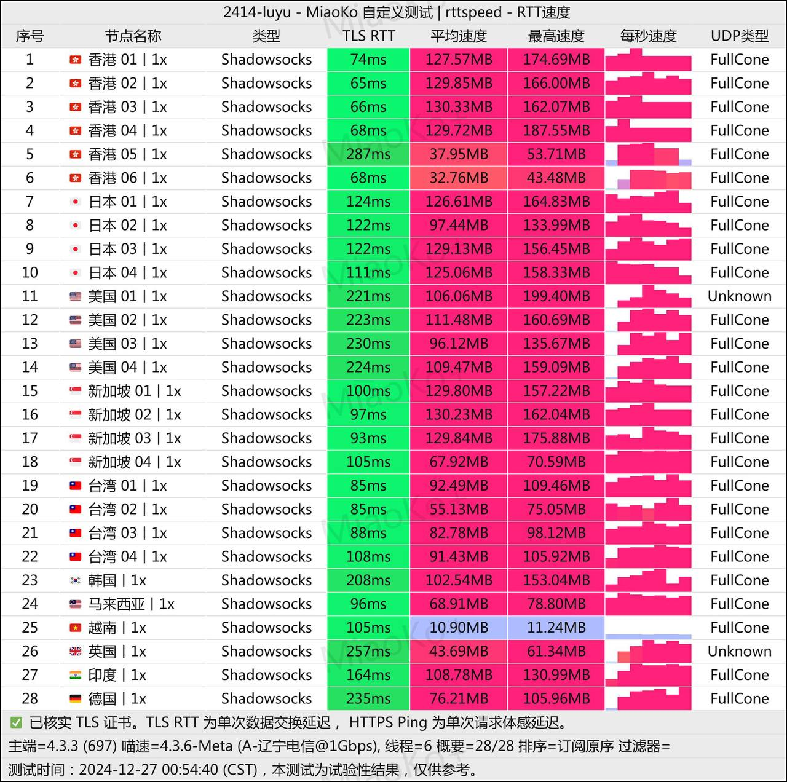
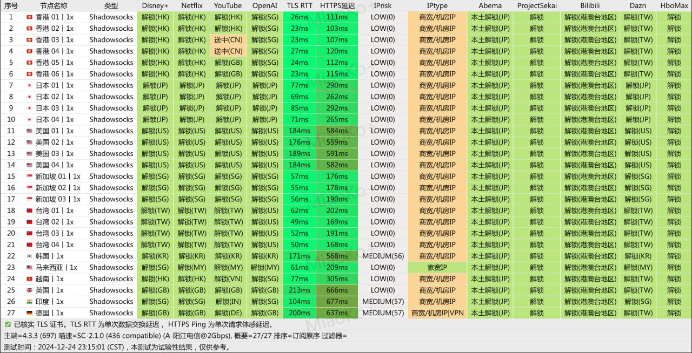

# 鹿语云
鹿语云机场-2024 年新锐小众机场，全新体验

鹿语云机场，于 2024 年正式上线，是一个专注于提供高质量 IEPL 专线节点的小众机场。新用户注册即可免费试用 3 天，并享有 5G 流量，为您开启畅快的网络加速体验。

鹿语云

**服务概览**
--------

*   **传输协议**：Shadowsocks
*   **付款方式**：支持支付宝
*   **国际节点覆盖**：🇭🇰香港、🇯🇵日本、🇹🇼台湾、🇸🇬新加坡、🇺🇸美国
*   **特色优化**：针对 Telegram DC5 节点专门优化，保障高速连接。

**套餐详情**
--------

**1\. 迷你套餐**

*   **价格**：￥36 / 季度
*   **流量**：每月 50G（0.4倍率节点折合可用 125GB）
*   **特点**：支持语音、游戏、UDP；解锁海外主流流媒体 / AI 工具；最高速率达 500Mbps

**2\. 轻量套餐**

*   **价格**：￥19 / 月
*   **流量**：每月 100G（0.4倍率节点折合可用 250GB）
*   **特点**：适合中轻度用户，支持游戏、流媒体解锁，峰值速率同样为 500Mbps

**3\. 标准套餐（推荐）**

*   **价格**：￥29 / 月
*   **流量**：每月 200G（0.4倍率节点折合可用 500GB）
*   **特点**：高性价比套餐，支持全功能解锁；最高速率可达 1000Mbps

**4\. 旗舰套餐**

*   **价格**：￥59 / 月
*   **流量**：每月 500G（0.4倍率节点折合可用 1250GB）
*   **特点**：不限设备数，全天候不限速；适合大流量需求用户

**5\. 定制套餐**

*   **价格**：￥688 / 月
*   **特点**：专属 IP、独享带宽，适合 TikTok 直播及跨境电商卖家；提供即时技术支持，全天不限速

机场测速
----

机场测速

机场测速

**使用说明**
--------

*   **流量计费规则**：按量计费套餐重复购买将重置当前流量，不会叠加。
*   **更换套餐限制**：未到期情况下更换套餐，上一个套餐将失效。
*   **温馨提示**：因稳定性考虑，建议月付以保证平安体验；猎户座套餐不在推荐范围内。

**服务优势与限制**
-----------

*   **优势**：全节点采用 IEPL 内网传输，支持主流代理应用，解锁海外流媒体及 AI 工具；无设备限制。
*   **限制**：暂不支持新疆地区，无退款政策。

**总结与展望**
---------

鹿语云机场致力于为用户提供高质量、稳定的网络加速服务。无论是轻量需求用户，还是高流量需求者，都能找到合适的套餐。同时，强大的技术支持与丰富的节点选择让其成为小众机场市场的一匹黑马。

立即注册并享受优质服务，开启您的畅快网络之旅吧！

> 鹿语云 - 2024 年新锐小众机场，全新体验：访问[官网](https://tiao.bid/249)订阅。
